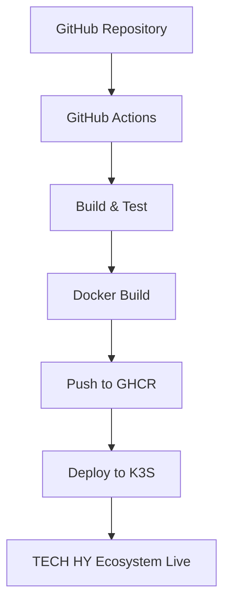

# 🚀 TECH HY Ecosystem CI/CD Deployment Guide

## 📋 Overview

Этот проект использует современную CI/CD систему на базе GitHub Actions для автоматического деплоя на K3S Kubernetes кластер.

## 🏗️ Архитектура



## 🔧 Настройка CI/CD

### 1. GitHub Secrets

Необходимо настроить следующие секреты в настройках репозитория:

```bash
# GitHub Settings -> Secrets and variables -> Actions -> Repository secrets

KUBECONFIG              # Base64 encoded kubeconfig для K3S кластера
```

#### Получение KUBECONFIG:

```bash
# На K3S сервере
sudo cat /etc/rancher/k3s/k3s.yaml | base64 -w 0
```

### 2. GitHub Container Registry

Проект автоматически использует GitHub Container Registry (ghcr.io) с токеном `GITHUB_TOKEN`.

## 🌍 Environments

### Production Environment
- **Branch**: `main`
- **URL**: `https://ecosystem.techhy.me`
- **K3S Namespace**: `techhy-ecosystem`
- **Image Tag**: `latest`, `main-{sha}`

### Development Environment  
- **Branch**: `develop`
- **URL**: `https://dev-techhy-ecosystem.k3s.local`
- **K3S Namespace**: `techhy-ecosystem-dev`
- **Image Tag**: `develop-dev`, `dev-{sha}`

## 📦 Компоненты CI/CD

### 1. Smart Contracts Pipeline
```yaml
# .github/workflows/ci-cd.yml
jobs:
  smart-contracts-test:
    - Компиляция контрактов (Hardhat)
    - Запуск тестов
    - Coverage отчёт
```

### 2. Frontend Pipeline
```yaml
# .github/workflows/ci-cd.yml
jobs:
  frontend-build:
    - Type checking (TypeScript)
    - Linting (ESLint)
    - Unit tests (Vitest)
    - Production build (Vite)
```

### 3. Docker Pipeline
```yaml
# Multi-stage Dockerfile
Stage 1: Build (Node.js 20 Alpine)
Stage 2: Production (Nginx Alpine)
```

### 4. Kubernetes Deployment
```yaml
# K3S Resources
- Namespace
- Deployment (with HPA)
- Service (ClusterIP)
- Ingress (with TLS)
- ConfigMap & Secrets
```

## 🐳 Docker Configuration

### Dockerfile Features
- **Multi-stage build** для оптимального размера образа
- **Runtime environment substitution** через envsubst
- **Nginx оптимизация** для SPA
- **Health checks** и security headers
- **Cross-platform builds** (amd64/arm64)

### Runtime Environment Variables
```bash
# Contract addresses
REACT_APP_VC_TOKEN=0xC88eC091302Eb90e78a4CA361D083330752dfc9A
REACT_APP_VG_TOKEN=0xe87c0Ff36084033FfB56aCf68F2dD5857C65342d
REACT_APP_LP_LOCKER=0x9269baba99cE0388Daf814E351b4d556fA728D32

# Network config
REACT_APP_BSC_RPC_URL=https://bsc-dataseed.binance.org/
REACT_APP_BSC_CHAIN_ID=56

# Branding
REACT_APP_BRAND_NAME="TECH HY Ecosystem"
REACT_APP_BRAND_URL=https://techhy.me
```

## ☸️ Kubernetes Configuration

### Resource Structure
```
k8s/
├── namespace.yaml      # Namespace isolation
├── deployment.yaml     # App deployment + HPA
├── service.yaml        # ClusterIP service
├── ingress.yaml        # HTTPS ingress
└── configmap.yaml      # Configuration & secrets
```

### Production Features
- **Horizontal Pod Autoscaler** (2-10 pods)
- **Rolling updates** с zero downtime
- **Resource limits** и requests
- **Health checks** (liveness/readiness)
- **Security contexts** и non-root containers
- **TLS certificates** через cert-manager

## 🔒 Security

### Container Security
- Non-root user (nginx:101)
- Read-only root filesystem (where possible)
- Dropped capabilities
- Security headers в nginx

### Network Security
- Rate limiting в ingress
- CORS configuration
- CSP headers
- TLS 1.2+ only

## 📊 Monitoring

### Health Checks
```bash
# Application health
curl https://ecosystem.techhy.me/health

# Kubernetes health
kubectl get pods -n techhy-ecosystem
kubectl describe deployment techhy-ecosystem-frontend -n techhy-ecosystem
```

### Logs
```bash
# Application logs
kubectl logs -f deployment/techhy-ecosystem-frontend -n techhy-ecosystem

# Ingress logs
kubectl logs -f deployment/nginx-ingress-controller -n ingress-nginx
```

## 🚀 Деплой процесс

### Автоматический деплой (рекомендуется)
```bash
# Production deploy
git push origin main

# Development deploy  
git push origin develop
```

### Ручной деплой
```bash
# Build and push manually
docker build -t ghcr.io/gyberexperiment/tech-hy-ecosystem:manual .
docker push ghcr.io/gyberexperiment/tech-hy-ecosystem:manual

# Deploy to K3S
export IMAGE_TAG=manual
export NAMESPACE=techhy-ecosystem
envsubst < k8s/deployment.yaml | kubectl apply -f -
```

## 🔄 Rollback

### GitHub Actions Rollback
```bash
# Найти предыдущий successful commit
git log --oneline -n 10

# Force push к предыдущему коммиту
git reset --hard <previous-commit>
git push --force-with-lease origin main
```

### Kubernetes Rollback
```bash
# Rollback к предыдущей версии
kubectl rollout undo deployment/techhy-ecosystem-frontend -n techhy-ecosystem

# Rollback к конкретной ревизии
kubectl rollout undo deployment/techhy-ecosystem-frontend --to-revision=2 -n techhy-ecosystem

# История деплоев
kubectl rollout history deployment/techhy-ecosystem-frontend -n techhy-ecosystem
```

## 🧪 Тестирование

### Local Testing
```bash
# Smart contracts
npm run test
npm run coverage

# Frontend
cd frontend
npm run test
npm run lint
npm run type-check
```

### Docker Testing
```bash
# Build local image
docker build -t techhy-ecosystem:test .

# Run locally
docker run -p 8080:80 techhy-ecosystem:test

# Test health
curl http://localhost:8080/health
```

### K3S Testing
```bash
# Port forward для локального тестирования
kubectl port-forward service/techhy-ecosystem-frontend-service 8080:80 -n techhy-ecosystem

# Test через port forward
curl http://localhost:8080/health
```

## 📈 Масштабирование

### Horizontal Scaling
```bash
# Ручное масштабирование
kubectl scale deployment techhy-ecosystem-frontend --replicas=5 -n techhy-ecosystem

# Изменение HPA limits
kubectl patch hpa techhy-ecosystem-frontend-hpa -n techhy-ecosystem -p '{"spec":{"maxReplicas":20}}'
```

### Resource Optimization
```bash
# Мониторинг ресурсов
kubectl top pods -n techhy-ecosystem
kubectl describe hpa techhy-ecosystem-frontend-hpa -n techhy-ecosystem

# Обновление resource requests/limits в deployment.yaml
```

## 🆘 Troubleshooting

### Common Issues

#### 1. Deploy Failed
```bash
# Check GitHub Actions logs
# Check pod status
kubectl get pods -n techhy-ecosystem
kubectl describe pod <pod-name> -n techhy-ecosystem
```

#### 2. Image Pull Errors
```bash
# Check image exists
docker pull ghcr.io/gyberexperiment/tech-hy-ecosystem:latest

# Check registry permissions in GitHub
```

#### 3. Ingress Issues
```bash
# Check ingress status
kubectl get ingress -n techhy-ecosystem
kubectl describe ingress techhy-ecosystem-ingress -n techhy-ecosystem

# Check cert-manager certificates
kubectl get certificates -n techhy-ecosystem
```

#### 4. Health Check Failures
```bash
# Check application logs
kubectl logs -f deployment/techhy-ecosystem-frontend -n techhy-ecosystem

# Test health endpoint
kubectl exec -it <pod-name> -n techhy-ecosystem -- wget -O- http://localhost:80/health
```

## 📞 Support

- **Email**: i@techhy.me
- **Documentation**: https://github.com/GyberExperiment/tech-hy-ecosystem
- **Issues**: GitHub Issues в репозитории 